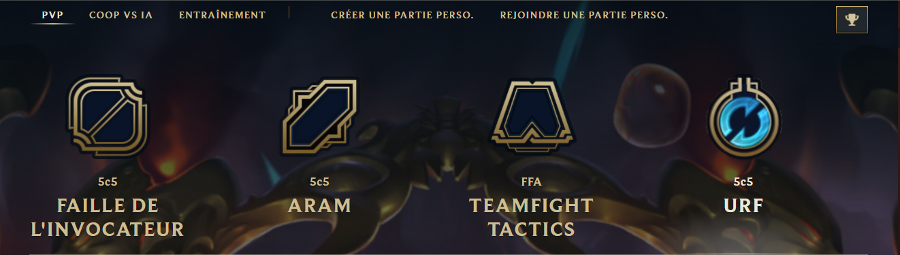
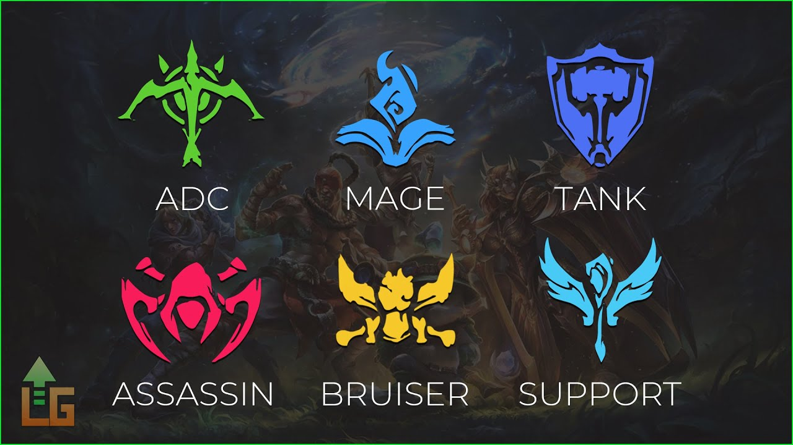

# League Of Legends Guide

>[League of Legends](https://fr.wikipedia.org/wiki/League_of_Legends) (abrégé LoL) est un jeu vidéo sorti en 2009 de type arène de bataille en ligne, free-to-play, développé et édité par [Riot Games](https://fr.wikipedia.org/wiki/Riot_Games) sur Windows et Mac OS, des joueurs peuvent s'affronter en équipe et en ligne, lors de combats prenant place dans un univers fantstique.

## Quelle est l'histoire de League of Legend ?

>L'idée de League of Legends advient lorsque [Steve Feak](https://fr.wikipedia.org/wiki/Steve_Feak) “Guinsoo”, développeur du mod de Warcraft 3 Defense of the Ancients (plus connu sous le nom de [DOTA](https://fr.wikipedia.org/wiki/Dota_2)), et l'administrateur du mod, [Steve Mescon](https://leagueoflegends.fandom.com/wiki/Steve_%27Pendragon%27_Mescon) “Pendragon”, font la connaissance du tout jeune studio Riot Games en 2005.

## Mode de jeu PVP

| FAILLE DE L'INVOCATEUR | ARAM | TEAMFIGHT TACTICS | MODE TEMPORAIRE |
|:----------------------:|:----:|:--------------:|:--------------:|
| Dominez votre voie, lancez-vous dans des combats d'équipes titanesques en 5c5 et détruisez le Nexus ennemi dnas le meilleure mode de jeu compétitif de League.         | Dix champion sélectionnés aléatoirement sont réunis sur l'étroit pont d'une région glacée. Traversez-la et détruisez tout sur votre chemin. | Assemblez un groupe de champions qui combattront pour vous. Résistez aux assault de vos sept adversaireset soyer le dernier survivant. | Tout dépend du mode temporaire. |
| ***Mode aveugle :*** Dans ce mode de jeu, deux équipes de cinq joueurs s'affrontent sur une carte symétrique, en forme de carré, afin de détruire le Nexus adverse gardé par les champions ennemis, et des structures défensives nommées « tourelles ». ***Mode draft :*** Les deux capitaines doivent alors bannir des champions. Ensuite, les équipes sélectionnent chacune leur tour des champions, en n'oubliant pas que les choix sont visibles par l'équipe adverse, qui peut donc sélectionner des champions pour contrer la stratégie de l'autre. ***Classé en solo/duo :*** Dans ce mode vous pourrez jouer en classé soit en solo soit en duo avec un mate ou un random. ***Classé flexible :*** Et pout finir, dans ce mode la vous pourez jouer en classé aussi mais en groupe de quatre ou cinq, groupe de trois interdit. | Aucun mode | ***Mode standard :*** Jouez a TFT normalement. ***Double up :*** Dans Double Up, vous partagez vos victoires, vos défaites et même certains de vos champions avec un autre joueur. Vous pouvez faire la queue avec quelqu'un de votre liste d'amis, ou vous pouvez lancer les dés et faire correspondre quelqu'un au hasard. Dans tous les cas, vous n'affronterez jamais ce joueur au combat. ***Mode classé :*** Jouez a TFT en classé. ***Hyper roll :*** Version plus courte et concise du TFT standard. | Tout dépend du mode temporaire. |

 ---
 
## Type de rôles

>Les rôles se sont des catégories en quelques sortes pour classer les champions en fonction de leurs styles de jeu. Il est important de connaitre les rôles (qui sont définis par Riot Games) des champions avant de les jouer pour savoir à quel postes ils seront le mieux afin de profiter un maximum de leurs capacités. Surtout que les personnages ont tous des points faibles, c’est ça aussi qui les classes dans certaines catégories. Alors si vous vous amusez à mettre un champion à l’endroit où il ne va pas, vous ne verrez que ses points faibles et ne comprendrez pas forcément en quoi le champions est bien. Car oui TOUT les champions de League of Legends  sont intéressants à jouer car ils ont tous un style de jeu bien à eux.

***Il y a donc 6 rôles :***

* **Les assassins :** 

     * Les assassins se spécialisent dans l'infiltration des lignes ennemies grâce à leur mobilité inégalée pour envoyer rapidement des cibles hautement prioritaires. En raison de leur nature principalement de mêlée, les Assassins doivent les placer eux-mêmes dans des positions dangereuses afin d'exécuter leurs cibles. Heureusement, ils ont souvent des astuces défensives dans leurs manches qui, s'ils sont utilisés intelligemment, leur permettent d'éviter efficacement les dégâts entrants. 

* **les mages :**

     * Les mages sont des champions qui possèdent généralement une grande portée, des dégâts de zone d'effet basés sur les capacités et un contrôle des foules, et qui utilisent toutes ces forces en tandem les unes avec les autres pour piéger et détruire les ennemis à distance. Spécialisés dans les dégâts magiques, souvent en rafale, et investissant donc massivement dans des objets leur permettant de lancer des sorts plus forts et plus rapides, les mages excellent à enchaîner leurs capacités dans de puissants combos afin de gagner des combats, bien que leurs capacités aient également tendance à être difficiles à maîtriser. terre et peuvent être atténués, voire complètement évités, par leurs cibles s'ils réagissent à temps.

* **les tanks :**

     * Les chars sont des champions de mêlée coriaces qui sacrifient des dégâts en échange d'un puissant contrôle des foules. Bien qu'il soit capable d'engager des ennemis au combat, le but d'un char n'est généralement pas de tuer des adversaires ; au lieu de cela, les chars excellent à perturber les ennemis et à détourner l'attention sur eux-mêmes, leur permettant de verrouiller des cibles spécifiques (ou plusieurs cibles à la fois), ainsi que de supprimer (ou d'éplucher) les menaces de leurs alliés.

* **les tireurs (ADC) :**

     * Dans LoL, l’ADC (Attack Damage Carry), ou AD Carry, est un terme qui fait référence aux champions qui font des dégâts importants et continus aux adversaires grâce à leurs attaques de base, et qui ont des stats centrées sur l’attaque et les dégâts physiques. En résumé, ce sont des champions qui peuvent infliger des dégâts particulièrement élevés aux adversaires mais qui, d’un autre côté, sont assez faibles et ne peuvent pas encaisser énormément de coups.

* **les supports:**

     * Au sein d'une équipe repêchée, le Support est l'un des deux champions affectés à la voie du bas aux côtés du Bottom Carry. L'objectif initial de ce rôle est d'aider leur coéquipier le plus vulnérable au cours des premières étapes du jeu, et c'est une position qui convient aux champions avec une utilité, un désengagement ou des dégâts de base élevés.

* **les combattants (BRUISER) :**

     * Les combattants (également connus sous le nom de Bruisers) sont un groupe diversifié de combattants à courte portée qui excellent à la fois pour infliger et survivre aux dégâts. Avec un accès facile à des dégâts lourds et continus (ou DPS) et une multitude de défenses innées, les combattants prospèrent dans des combats prolongés alors qu'ils recherchent des ennemis à abattre, mais leur portée limitée les expose à un risque constant d'être tenus à distance (ou kités) par leurs adversaires via le contrôle des foules, la portée et la mobilité.

La plus part des champions de League of Legends ont deux rôles : un principale (ce dans quoi ils sont les meilleurs) et un secondaire.

## Les Lane (voies)

