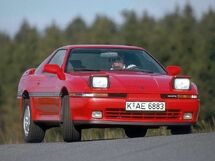
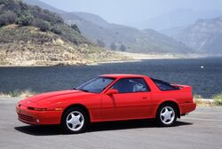

**Toyota Supra**

==Test==

>La [Toyota Supra](https://fr.wikipedia.org/wiki/Toyota_Supra) (ou "トヨタスープラ" en japonais) est une voiture de grand tourisme produite par le constructeur automobile japonais [Toyota](https://fr.wikipedia.org/wiki/Toyota_(entreprise)), de 1979 jusqu'en 2002, puis à partir de 2019. La voiture a connu quatre générations successives et une cinquième plus tardivement, communément appelées MK1, MK2, MK3, MK4 et MK5 (MK étant l'abréviation de mark).

## ***Histoire***
------
>la supra a été crée par [Toyota](https://fr.wikipedia.org/wiki/Toyota_(entreprise)) afin de   rivaliser ses concurrents japonais comme européen comme:
* [La Nissan Skyline](https://fr.wikipedia.org/wiki/Nissan_Skyline_GT-R)
* [La Nissan 300ZX](https://fr.wikipedia.org/wiki/Nissan_300ZX)
* [La Mitsubishi GTO](https://fr.wikipedia.org/wiki/Mitsubishi_GTO)
* [La Honda NSX](https://fr.wikipedia.org/wiki/Honda_NSX)
* [La Mazda RX-7](https://fr.wikipedia.org/wiki/Mazda_RX-7)
* [La Nissan FairladyZ](https://fr.wikipedia.org/wiki/Mitsubishi_Lancer_Evolution)
* [La Nissan 200SX](https://fr.wikipedia.org/wiki/Nissan_200SX)
* [La Subaru Impreza WRX STI](https://fr.wikipedia.org/wiki/Subaru_Impreza)

## ***Supra première génération (mk1)***
------
>la première génération de supra est produite d'avril 1978 a mai 1981. Elle est réservé au marché japonais et nord américain. Cette génération de supra a pour objectif de concurrencer les [Datsun Z](https://fr.wikipedia.org/wiki/Datsun). Elle est construite sur une base de [Celica](https://fr.wikipedia.org/wiki/Toyota_Celica) liftback qui a été rallonger afin d'y positionner un moteur 6 cylindre en ligne qui remplace le 4 cylindre de la [Celica](https://fr.wikipedia.org/wiki/Toyota_Celica).

***Different moteur (tous basé sur le bloc M à injection)***
| Code moteur    | Cylindré   | Type             | Puissance      |
|:--------------:|:----------:|:----------------:|:--------------:|
| M-EU           | 2L         | Atmosphérique    | 110            |
| M-TEU          | 2L         | Turbo            | 125            |
| 4-ME           | 2,6        | Atmosphérique    | 135            |
| 5M-E           | 2,8L       | Atmosphérique    | 145            |

## ***Supra Deuxième génération (mk2)***
-------
>La deuxième génération est produite de juillet 1981 a décembre 1985. Elle est assemblé à [Tahara](https://fr.wikipedia.org/wiki/Tahara_(Aichi)) au Japon. Elle est commercialisé au Japon, en Amérique du Nord et en Europe. Elle est considéré comme la première véritable Supra avec ses phares rétractable, son six cylindre en ligne capable de développer plus de 170 chevaux se qui lui ouvre les portes de la catégorie [grand tourisme](https://fr.wikipedia.org/wiki/Grand_tourisme).

## ***Supra Troisième génération (mk3)***
-------
>La troisième génération de Supra est produite de 1986 à 1993. Elle reprend le 6 cylindre en ligne qui a fait le succès de la précédente. Elle se détache définitivement de la [Celica](https://fr.wikipedia.org/wiki/Toyota_Celica) par son appelation commercial, sa longueur plus importante et le coté propulsion.
Beaucoup d'option deviennent de série telles que la direction assistée, le verrouillage centralisé, le régulateur de vitesse, réglage électrique des siège et régulateur de vitesse.
Cette génération de Supra sortira en plusieurs déclinaison.

1. **Phase 1**
    * *Code Moteur* : 7M-GE
    * *Puissance* (chevaux) : 204
    * *Changements Distinctifs* : 
        1. Pas de « nez » sur la calandre avant, mais une grille.
        2. Des blocs clignotant/veilleuses larges.
        3. Bas de pare-chocs fin avec des anti-brouillards avants en losange.
        4. Un intérieur (sièges, planche de bord, volant et commande de climatisation) spécifiques.
        5. Un aileron « simple » qui ne pose que sur la malle arrière
        6. Logo rectangulaire « Supra » sur le capot.
        7. Des jantes semi pleines.
    * Photo:
    
        
2. **Phase 2**
    * *Code Moteur* : 7M-GTE
    * *Puissance* (chevaux) : 235
    * *Changements Distinctifs* : 
        1. Un nez est apparu sur le bouclier avant.
        2. Des blocs clignotant/veilleuses plus petits.
        3. Bas de pare-chocs plus imposant avec des anti-brouillards avants en rectangle.
        4. Un intérieur (sièges, planche de bord, volant et commande de climatisation) spécifiques, plus « modernes ».
        5. Un aileron qui occupe quasiment toute la largeur de l'auto et qui est pris sur la malle avec des extensions sur les ailes arrière       
        6. Un logo Supra rectangulaire sur le capot.
        7. Des jantes semi pleines.
    * Photo :

        
3. **Phase 3**
    * *Code Moteur* : 7M-GTE
    * *Puissance* (chevaux) : 238
    * *Changements Distinctifs* : 
        1. Changement par un logo ovale Toyota sur le capot (au lieu du logo Supra rectangulaire).
        2. Des jantes à cinq branches.
        3. Lèvre de pare-choc différente, pour amener de l'air frais sur les freins avant, à la suite de la disparition des jantes des premières phases, conçus d'origine pour évacuer la chaleur des freins.
    * Photo:

        
4. **série spéciale Turbo-A**
    * *Code Moteur* : 7M-GTEU
    * *Puissance* (chevaux) : 266
    * *Changements Distinctifs* : 
        1. produite pour le [rallye](https://fr.wikipedia.org/wiki/Rallye_automobile) en groupe A et 500 exemplaires pour la route (pour pouvoir l'homologuer en [groupe A](https://fr.wikipedia.org/wiki/FIA_Groupe_A)) entre 1988 à 1992.
        2.  Un large logo « Turbo A » fait son apparition sur les côtés.
    * Photo:

        

## ***Supra quatrième génération (mk4)***
------
>La Supra mk4 est LA supra la plus connue grâce au film [Fast and Furious](https://fr.wikipedia.org/wiki/Fast_and_Furious). Cette Supra est également reconnue dans le monde de l'automobile grâce a son moteur [2JZ](https://en.wikipedia.org/wiki/Toyota_JZ_engine) et a toute les préparation et modification sur ce moteur pouvant être augmenter jusqu'à plus de 1000 chevaux. La mk4 est également connu pour ses modification esthétique avec beaucoup de kits larges et autres.

>Cette génération est sortie avec deux moteurs différent tout deux étant des 6 cylindres en lignes de 3L,le 2JZ-GE un moteur atmosphérique développent 220 chevaux et un moteur bi-turbo, le 2JZ-GTE sortant 330 chevaux.

* **Supra mk4 d'origine**

    

    * *moteur 2JZ-GE(atmosphérique) d'origine*

        
    
    * *moteur 2JZ-GTE(bi-turbo) d'origine*

        
* **Supra mk4 modifié**

    

    * *moteur 2JZ-GE(atmosphérique) modifié*

        
    
    * *moteur 2JZ-GTE(bi-turbo) modifié*

        

 ## ***Supra cinquième génération (mk5)***   
 -------
 >La supra mk5 dite [GR Supra](https://fr.wikipedia.org/wiki/Toyota_GR_Supra) est la dernière génération en date elle est produite depuis 2019 et est toujours en production. Elle est disponible avec 2 moteurs différents, un 4 cylindres en ligne de 2L avec une puissance de 258 chevaux ou un 6 cylindre en ligne bi-turbo sui développe jusqu'à 387 chevaux.

 
